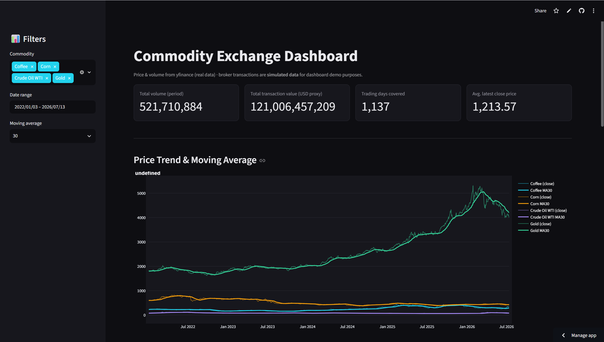
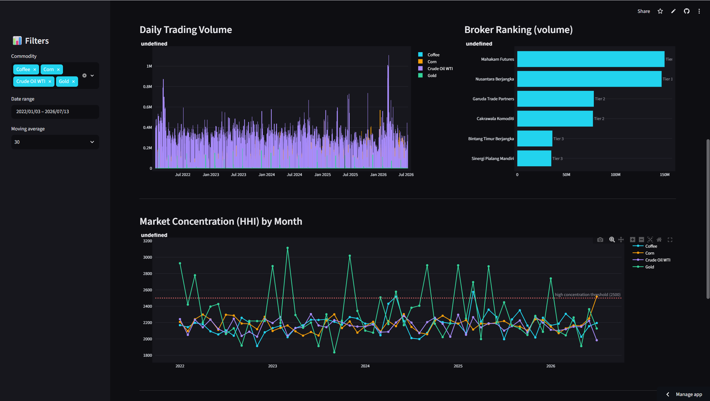
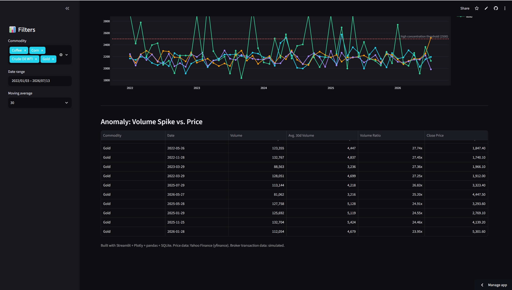

# Commodity Exchange Dashboard

An interactive dark-themed dashboard for commodity price & volume
(Crude Oil, Gold, Corn, Coffee), built with Python (Streamlit + pandas +
Plotly) on top of a SQLite database.

## Preview







## Getting started

```bash
pip install -r requirements.txt
python generate_data.py      # builds commodity_dashboard.db (one-off / data refresh)
streamlit run dashboard.py   # opens the dashboard at http://localhost:8501
```

`generate_data.py` produces `commodity_dashboard.db` (SQLite) with 5
tables matching `schema.sql`. The database is already committed to this
repo, so the dashboard can run immediately without re-pulling data first.

## What's in the dashboard (`dashboard.py`)

- Price trend + moving average (7/14/30-day), per commodity
- Daily trading volume
- Broker ranking by volume
- Market concentration (HHI) by month
- Anomaly detection: volume spikes vs. stagnant price

Commodity and date-range filters live in the sidebar.

## What's been validated (end-to-end, with internet access)

- `schema.sql` — executes with no errors, all tables/indexes created.
- `generate_data.py` — run fully to populate `commodity_dashboard.db`:
  1,656 `dim_date` rows, 4,544 `fact_market_daily` rows (real data from
  yfinance for CL=F, GC=F, ZC=F, KC=F), 27,264 `fact_broker_transaction`
  rows. Daily broker volume totals match `total_volume` in
  `fact_market_daily` exactly.
- **Bug found & fixed**: current versions of `yf.download()` always
  return `MultiIndex` columns (Price, Ticker) even for a single ticker,
  which broke `row["Open"]`. Fixed in `fetch_and_load_market_data()` by
  flattening the columns with `hist.columns.get_level_values(0)` before
  processing.
- The five queries in `sample_queries.sql` — the same query patterns are
  reused in `dashboard.py` (moving average, volatility, broker ranking,
  HHI, volume anomalies) and have been tested via
  `streamlit.testing.v1.AppTest` with no exceptions.
- `dashboard.py` — run locally (`streamlit run`), responds HTTP 200, and
  passes `AppTest` (every chart/metric renders, no exceptions or
  deprecation warnings).

## Deploying for public access (free)

This repo is public on GitHub, so the code is already accessible to
anyone. To get a **live dashboard URL** (not just the code), use
Streamlit Community Cloud — free, no server of your own required:

1. Go to [share.streamlit.io](https://share.streamlit.io) and sign in
   with your GitHub account (the same one used to push this repo).
2. Click **New app** > select this repo > branch `master` > main file
   path `dashboard.py`.
3. Click **Deploy**. Within 1-2 minutes you'll get a public URL like
   `https://<app-name>.streamlit.app` that you can share with anyone.
4. `commodity_dashboard.db` is already committed to the repo, so the app
   runs with no extra setup. To refresh the price data, run
   `python generate_data.py` locally, commit, and push — Streamlit Cloud
   redeploys automatically.
